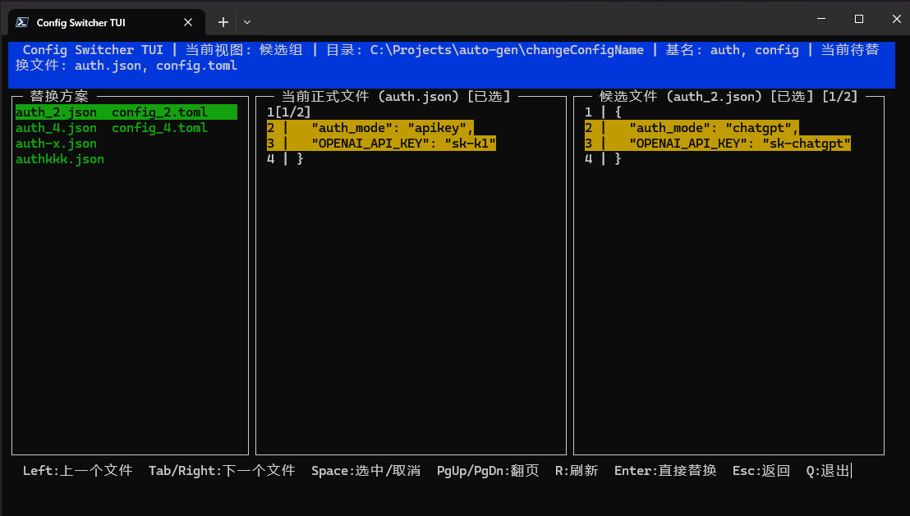
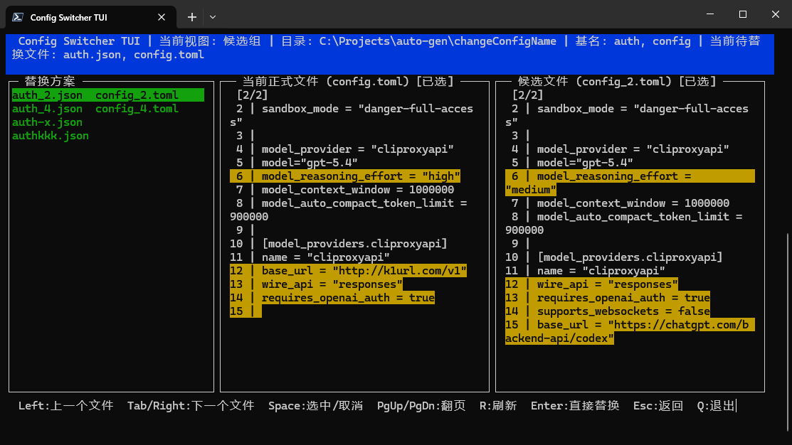
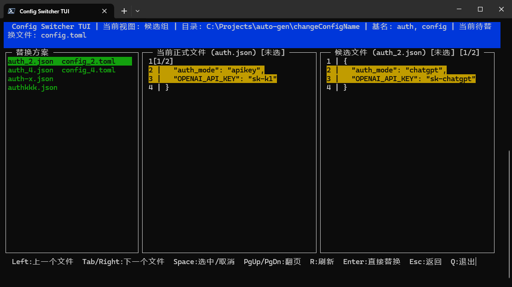
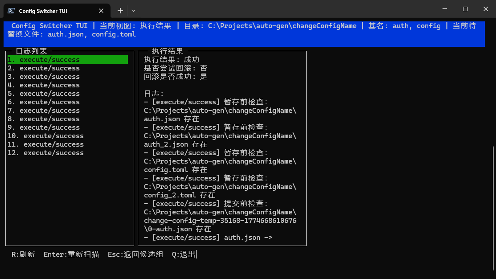

# configswitcher

[中文](./README.md) | [English](./README.en.md)


An interactive terminal tool for switching local configuration files safely.

`configswitcher` solves a narrow but surprisingly fragile workflow: switching between multiple config variants in one directory without leaving files in a broken or half-switched state.

```bash
npx configswitcher
cs .
cs /your/config/dir auth config
```

## Best For

- Keeping multiple `json`, `toml`, `yaml`, or similar config variants in one directory
- Switching quickly between active and candidate configs
- Reviewing file differences before execution
- Recovering automatically if anything fails during the switch

## Why Not Just Rename Files

Many config-switching scripts are just a chain of file renames.

That looks simple at first, but once multiple files must move together, rename chains can easily leave partial state, overwritten files, or incomplete rollback. `configswitcher` uses a safer content-swap model instead:

- Create a temporary transaction directory before execution
- Copy the involved files into snapshot storage
- Write snapshot content back to the target files
- Restore automatically from snapshots if any step fails
- Clean up leftover transaction folders on startup or refresh

It is not an OS-level atomic transaction, but it is a much better fit for manual local config switching than a fragile multi-file rename chain.

## Features

- Scan active and candidate files from a target directory
- Detect candidates by filename prefix without requiring `_`-style naming
- Prefer grouped variants first, then fall back to single-file variants
- Show a left-side scheme list and right-side per-file colored diff preview
- Let you choose which prefixes participate in the current switch
- Refresh directory state before execution
- Recover automatically on failure with explicit failure diagnostics

## UI Screenshots

The initial screen shows candidate schemes on the left and a diff view on the right:



Press `Tab` / `Right` to move to the next file comparison:



Press `Space` to include or exclude the current prefix from the switch:



Press `Enter` to execute the replacement directly:



## Quick Start

### Local development

```bash
npm install
npm run dev
```

### Run after build

```bash
npm run build
npm start
```

### Use as a CLI

```bash
npx configswitcher
```

Or after a global install:

```bash
cs
```

## Start Options

Start in the current directory:

```bash
npm run dev
```

Pass directory and basenames explicitly:

```bash
npm run dev -- . auth config
```

The published CLI supports the same forms:

```bash
cs .
cs . auth config
cs /your/config/dir auth config
```

In PowerShell, if you prefer comma-separated basenames, quote them:

```powershell
npm run dev -- . "auth,config"
```

## Shortcuts

Main screen:

- `Left`: previous file
- `Tab` / `Right`: next file
- `Space`: select/unselect
- `PgUp` / `PgDn`: page up/down
- `R`: refresh current directory state
- `Enter`: execute replacement
- `Esc`: return from result view
- `Q`: quit

Result screen:

- `R`: refresh current directory state
- `Enter`: rescan
- `Esc`: go back to candidate schemes

## How It Works

Example files:

```text
auth.json
auth_2.json
config.toml
config_2.toml
```

If you switch to the `auth_2.json + config_2.toml` variant, the tool will:

1. Create a transaction temp directory such as `change-config-temp-xxxx`
2. Copy the involved files into that directory as snapshots
3. Write the snapshot content back into the active and candidate files
4. Remove the temp directory on success
5. Restore original content from snapshots on failure

The important point is that it swaps content instead of renaming file identities:

- `auth.json` and `auth_2.json` both stay in place
- Their contents are exchanged on success
- The tool tries to restore the pre-run state on failure

## Candidate Detection Rules

Active files:

- Filename exactly matches the configured basename
- Example: `auth.json`, `config.toml`

Candidate files:

- Any filename that starts with the basename and is not the active file itself
- Example:
  - `auth_2.json`
  - `auth - x.json`
  - `auth-test.json`

## Replacement Scheme Rules

The tool first groups variants that share the same suffix across multiple basenames.

Example:

```text
auth.json
auth_2.json
config.toml
config_2.toml
```

It will first show a grouped scheme:

```text
auth_2.json  config_2.toml
```

If a candidate file does not have a matching grouped partner, it appears as a single-file scheme.

## Failure Details

When execution fails, the result view shows:

- failure reason
- failure stage
  - preflight
  - snapshot
  - staging
  - commit
- the failed step
- restored item count

## Testing

Run tests:

```bash
npm test
```

Current coverage includes:

- successful content swap
- restoration after write failure
- basic behavior on the real filesystem
- recovery of leftover snapshot or transaction files

## Release

Before pushing to GitHub:

```bash
npm test
npm run build
```

Before publishing to npm:

```bash
npm test
npm run build
npm publish
```

`package.json` already includes:

- `bin`
- `files`
- `prepublishOnly`

## Known Limits

- This is a best-effort recovery model, not an OS-level multi-file atomic transaction
- If external processes keep modifying the same files during execution, switching can still fail
- It is better suited for manual interactive switching than high-frequency concurrent automation

## License

This project is licensed under the [MIT License](./LICENSE).
